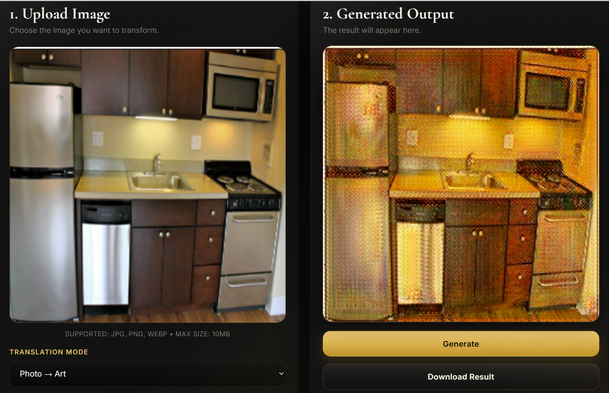
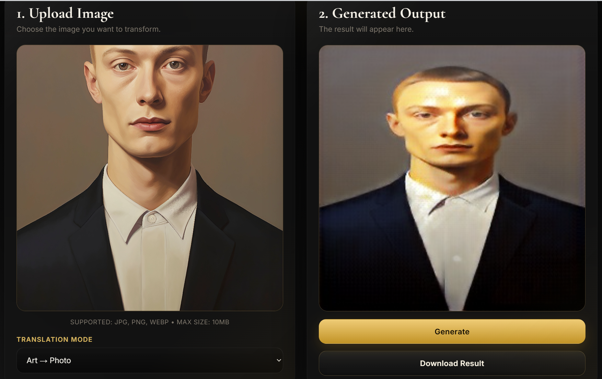

# 🎞️ Obscura AI

A full-stack deep learning web application for **bidirectional GAN-based image translation**.  
Transform real-world photos into artistic renderings, or convert artwork back into realistic photo-like images using a trained **CycleGAN** architecture.

The application features a cinematic darkroom-inspired interface, real-time image generation, drag-and-drop uploads, and downloadable outputs.




---

# ✨ Features

✅ **Bidirectional Image Translation**
- Photo → Art
- Art → Photo

✅ **CycleGAN Architecture**
- Two generators
- Two discriminators
- Unpaired image-to-image translation

✅ **FastAPI Backend**
- High-performance async API
- TensorFlow model inference
- Image preprocessing pipeline

✅ **Modern Analog-Inspired UI**
- Darkroom / film aesthetic
- Responsive design
- Drag & drop uploads

✅ **Download Generated Results**
- Export generated images instantly

✅ **Production-Ready Structure**
- Easy deployment
- Clean modular architecture
- CORS-enabled backend

---

# 🧠 Model Architecture

The project uses a **CycleGAN** consisting of:

## Generators
- `G_photo_to_art.keras`
  - Converts photos into artistic outputs

- `F_art_to_photo.keras`
  - Converts artwork back into realistic images

## Discriminators
- `Dx_photo.keras`
- `Dy_art.keras`

Discriminators are used only during training and are not required during deployment.

---

# ⚙️ Tech Stack

## Backend
- FastAPI
- Uvicorn

## Machine Learning
- TensorFlow
- Keras
- CycleGAN

## Image Processing
- Pillow
- NumPy

## Frontend
- HTML5
- CSS3
- Vanilla JavaScript

---

# 📂 Project Structure

```plaintext
obscura-ai/
│
├── app/
│   ├── static/
│   │   ├── index.html
│   │   ├── style.css
│   │   ├── script.js
│   │   └── image.png
│   │
│   ├── model/
│   │   ├── G_photo_to_art.keras
│   │   ├── F_art_to_photo.keras
│   │   ├── Dx_photo.keras
│   │   └── Dy_art.keras
│   │
│   └── main.py
│
├── requirements.txt
├── .gitignore
└── README.md
```

---

# 🚀 Getting Started

## ✅ Prerequisites

- Python 3.9+
- pip
- Virtual environment recommended

---

# 📥 Installation

## 1️⃣ Clone the repository

```bash
git clone https://github.com/YOUR_USERNAME/obscura-ai.git
cd obscura-ai
```

---

## 2️⃣ Create a virtual environment

### Windows

```bash
python -m venv venv
venv\Scripts\activate
```

### macOS / Linux

```bash
python3 -m venv venv
source venv/bin/activate
```

---

## 3️⃣ Install dependencies

```bash
pip install -r requirements.txt
```

---

## 4️⃣ Add trained models

Place your trained models inside:

```plaintext
app/model/
```

Required models:

```plaintext
G_photo_to_art.keras
F_art_to_photo.keras
```

---

# ▶️ Run the Application

Navigate to the app folder:

```bash
cd app
```

Start the FastAPI server:

```bash
uvicorn main:app --reload --port 8000
```

Open in browser:

```plaintext
http://127.0.0.1:8000
```

---

# 🔄 Translation Modes

## 🎨 Photo → Art

Transforms photographs into stylized artistic images using the trained generator:

```plaintext
G_photo_to_art.keras
```

---

## 📷 Art → Photo

Attempts to reconstruct artwork into realistic photo-like outputs using:

```plaintext
F_art_to_photo.keras
```

---

# 🖼️ Frontend Features

- Drag-and-drop upload
- Image preview
- Loading animation
- Download generated image
- Responsive design
- Darkroom-inspired UI

---

# 🧪 API Endpoint

## POST `/transform/`

### Form Data

| Field | Type | Description |
|---|---|---|
| `content_file` | File | Input image |
| `direction` | String | `photo_to_art` or `art_to_photo` |

---

# 📌 Example Request

```javascript
const formData = new FormData();

formData.append("content_file", file);
formData.append("direction", "photo_to_art");

fetch("http://127.0.0.1:8000/transform/", {
    method: "POST",
    body: formData
});
```

---

# 🧱 Deployment

This project can be deployed on:

- Render
- Railway
- Fly.io
- Hugging Face Spaces
- Docker
- AWS EC2
- Google Cloud Run

---

# 📖 Concepts Used

- GANs (Generative Adversarial Networks)
- CycleGAN
- Image-to-Image Translation
- Unpaired Training
- TensorFlow Inference Pipelines
- Instance Normalization
- REST APIs with FastAPI

---

# 📸 Future Improvements

- Multiple artistic styles
- Batch image processing
- User authentication
- GPU inference optimization
- Image history gallery
- Real-time webcam translation
- Diffusion model integration

---

# 👨‍💻 Author

Developed as a deep learning and full-stack AI project demonstrating:

- GAN training
- TensorFlow deployment
- FastAPI backend engineering
- Frontend integration
- Real-time image generation pipelines

---

# 📄 License

This project is licensed under the MIT License.
